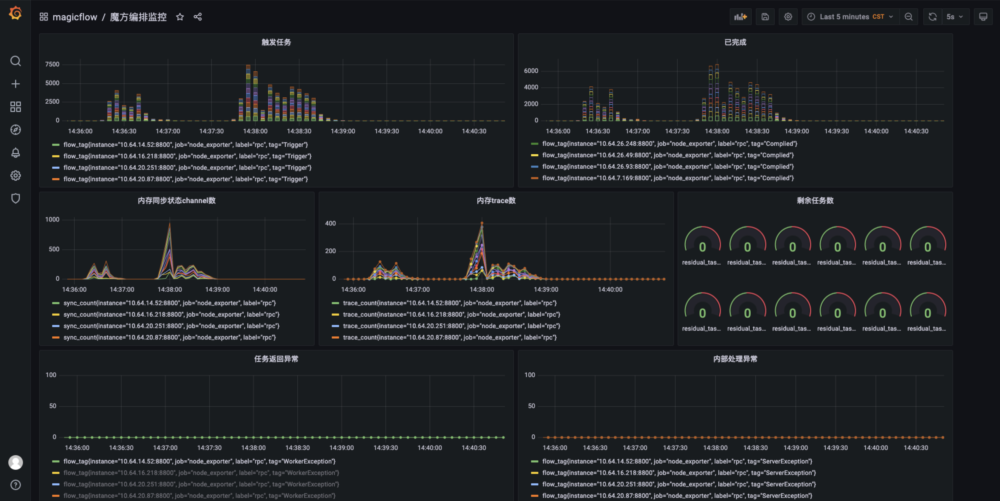
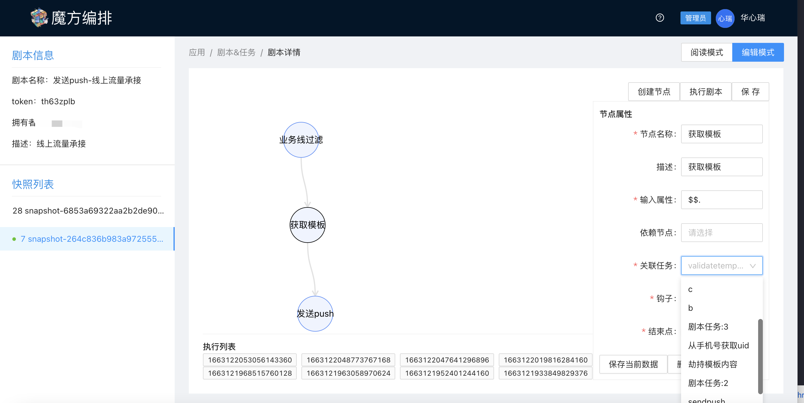
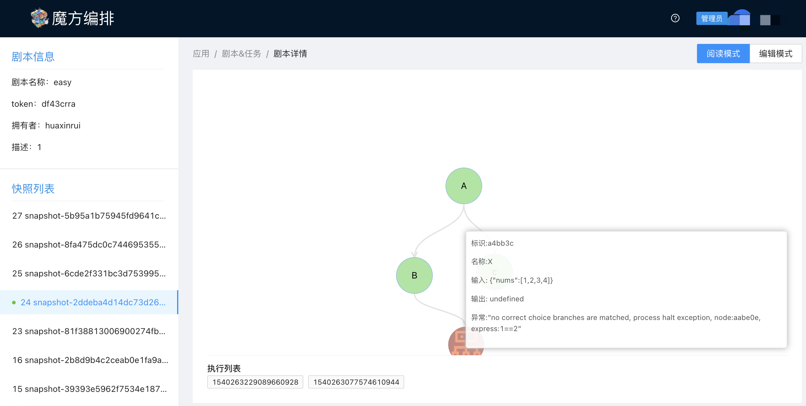
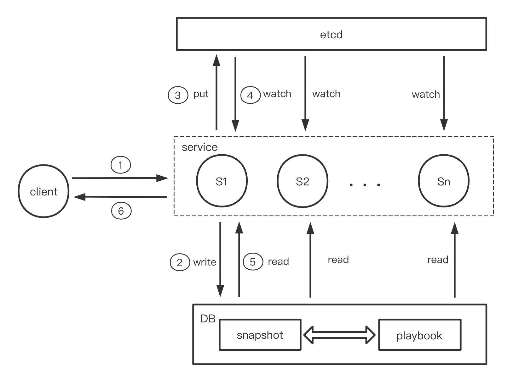

# magicFlow Introduction :)

Orchestration is a tendency for code-less deployment in the workflow scene,
which provide a graceful way to handle logic process. In order to decent 
cosmic work we abstracts the process to a configurable, intelligible and immense
flexible to launch our programming.

For more observation please refer to the following documents.
[魔方编排Wiki](https://wiki.xxx.com/pages/viewpage.action?pageId=146264643)

Incidentally, it would be appreciated if you can donate your code and ideas, any questions
please contact to huaxr.

# Guidance:
1. trigger will awake dispatch threads.
2. internalchan will transform messsage status between totrigger and toserver. (ret, exception ... e.g.)
3. dispatch start work which will change the attributes of messages and hatch toslave as the same time.
   on the retrospect of restrain designate, requeue and sending to real mq is generated by the core function defaultHandlerMsg.
4. under the control of DAG, we abstract fucntion stack to a intelligible node connections. 
5. more detail please fllow this page [魔方编排系统](https://flow.xxx.com/#/g6)  under construction currently :)
6. [go 版本SDK](https://github.com/huaxr/flowsdk-go) 
7. [go worker 开发示例](https://github.com/huaxr/worker-example)
8. 【PHP 版本SDK开发中...】

RPC service divid messgae to specific slave by traceId.
the /trigger/* will not support in triggersdk currently.(rpc modified)

# Table strategy
using snapshot id devide 10 tables of execution, cause this two api:
1. playbook/get_trace_detail?trace_id=[]
2. playbook/get_trace_list?snapshot_id=[]
for every query details api should with snapshot_id to calculate which table to fetch.

# Architecture

# Monitoring

# Display

# 安全性保障
- 【集群】worker && server 端连接 nsq 集群鉴权完成
由于nsq的鉴权是通三方托管的，目前鉴权api放在编排server中实现。
- 【防篡改】
消息在发送给 slave 时候会对 messge 的 meta 体做 jwt 签名， 并将签名token 做加盐MD5
客户端发往server时检验token和md5，以防止客户端对消息的篡改。
目前私钥对硬编码，需要借助秘钥托管进行秘钥保护。
- 【跨剧本、跨APP鉴权】
类似于psm等名字服务
目前没有建立跨APP的鉴权处理，必要时会加上
- 【风控】
规避一切潜在的web漏洞
限流+告警

# 稳定性、高可用性保障
- 1 每个APP有qps限额，避免消息积压。
- 2 每个app有消费者健康状态检查，避免无消费情况导致消息积压。
- 3 使用优先级队列避免瞬时trigger积压
- 4 对brokers有健康状态检查，并热重启实现
- 5 对各broker使用负载均衡策略
- 6 每个app可以分配指定的brokers，避免资源浪费
- 7 集群状态大盘监控
- 8 master节点上报一些有用的信息等
- 9 worker会和server保持心跳，上报硬件信息，server可以控制worker执行一切必要的指令以及操作（可开关）
- 10 任务全解耦，链路全异步，极大提高吞吐并发，横向拓展性好。
- 11 必要的存储分库分表实现

# DCC 设计
- etcd：kv格式
- key:/flow/playbook/playbookid   value:version_snapshotid
- eg: /flow/playbook/10   value:version_1

