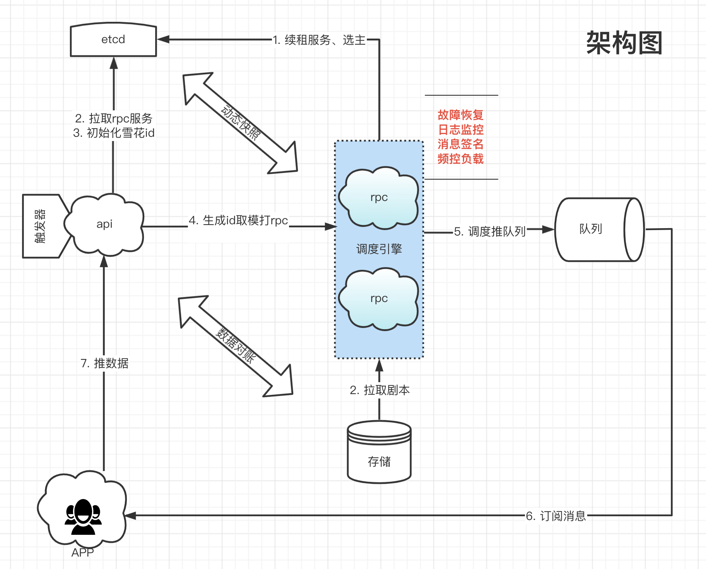
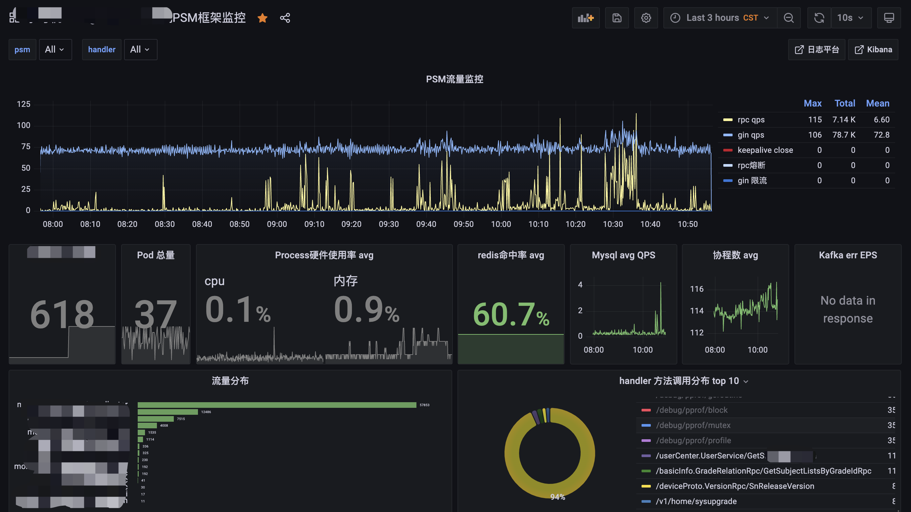
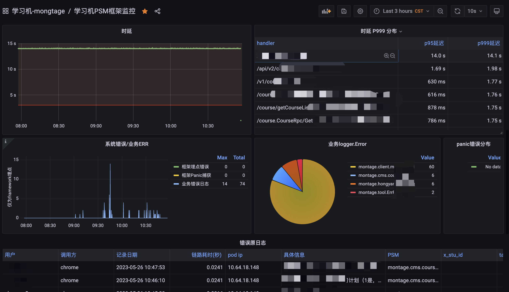
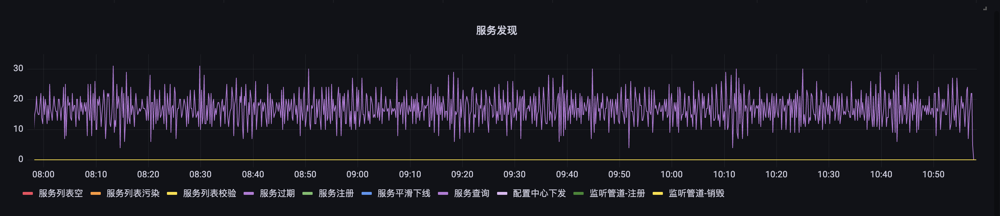

# magicFlow Introduction :)

Orchestration is a tendency for code-less deployment in the workflow scene,
which provide a graceful way to handle logic process. In order to decent 
cosmic work we abstracts the process to a configurable, intelligible and immense
flexible to launch our programming.

For more observation please refer to the following documents.
[魔方编排Wiki](https://wiki.xxx.com/pages/viewpage.action?pageId=146264643)

Incidentally, it would be appreciated if you can donate your code and ideas, any questions
please contact to huaxr.

# Guidance:
1. trigger will awake dispatch threads.
2. internalchan will transform messsage status between totrigger and toserver. (ret, exception ... e.g.)
3. dispatch start work which will change the attributes of messages and hatch toslave as the same time.
   on the retrospect of restrain designate, requeue and sending to real mq is generated by the core function defaultHandlerMsg.
4. under the control of DAG, we abstract fucntion stack to a intelligible node connections. 
5. more detail please fllow this page [魔方编排系统](https://flow.xesv5.com/#/g6)  under construction currently :)
6. [go 版本SDK](https://github.com/huaxr/flowsdk-go) 
7. [go worker 开发示例](https://github.com/huaxr/worker-example)
8. 【PHP 版本SDK开发中...】

RPC service divid messgae to specific slave by traceId.
the /trigger/* will not support in triggersdk currently.(rpc modified)

# Table strategy
using snapshot id devide 10 tables of execution, cause this two api:
1. playbook/get_trace_detail?trace_id=[]
2. playbook/get_trace_list?snapshot_id=[]
for every query details api should with snapshot_id to calculate which table to fetch.

# Architecture

# Monitoring

# 约束关系
- 节点设置 依赖 和 弱依赖，依赖是平行边必须等待结果的
- 弱依赖是条件边，必须满足互斥且唯一true输出， 全false会引起剧本中断
- 因为在剧本执行需要保证 end 幂等，（例如剧本嵌套、避免end执行多次），因此必须在多分支剧本中
 保持依赖关系避免破坏该均衡。 条件边在平行边执行之前会得到唯一一条true表达式， （单choice分支将变得没有意义）
 
